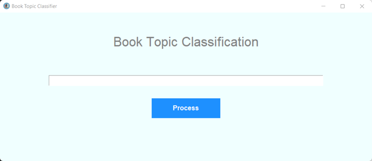
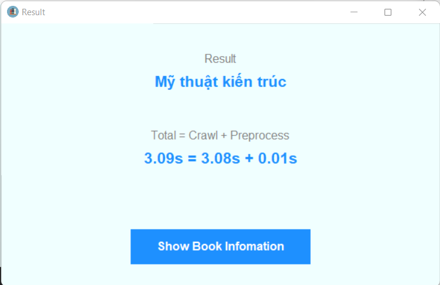
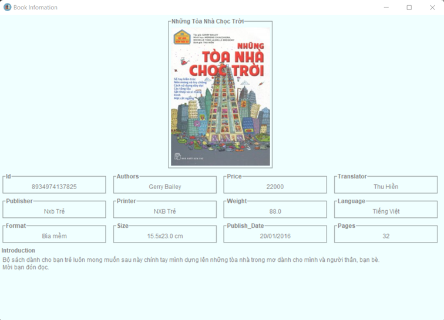
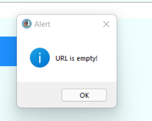
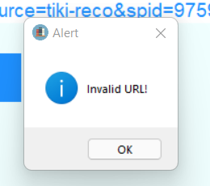

# BookTopicClassification

Đề tài: Phân loại chủ đề sách 

Nguồn dữ liệu: https://www.vinabook.com/

### Cài đặt
- Bước 1: Cài đặt thư viện python: *pip install -r requirements.txt*
- Bước 2: Sử dụng 1 IDE bất kỳ (ví dụ VSCode) để thực thi chương trình theo thứ tự như sau:
  - File crawl_utils.py: để crawl dữ liệu từ nhà sách VinaBook
  - File preprocess_utils.py: để tiền xử lý dữ liệu
  - File data_analysing.ipynb: thực hiện phân tích dữ liệu
  - File model_selection.ipynb: lựa chọn tham số, mô hình, sau đó huấn luyện và đánh giá
  - File app.py: để chạy chương trình demo

### Cách chạy demo
- Bước 1: Chạy file app.py từ thư mục chứa project. Giao diện ban đầu như sau:

- Bước 2: Nhập một đường dẫn của một quyển sách bất kỳ từ Vinabook và ấn Process. Ví dụ: https://www.vinabook.com/nhung-toa-nha-choc-troi-p67209.html

- Bước 3: Chọn Show Book Infomation để xem thông tin chi tiết của quyển sách

- Một số ngoại lệ:
  - Không nhập input:

  - Nhập đường dẫn không phải của Vinabook:

